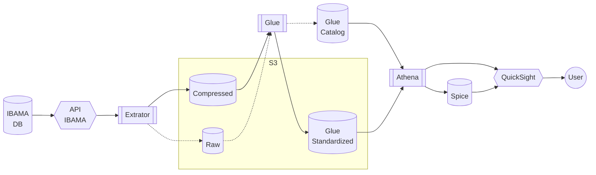
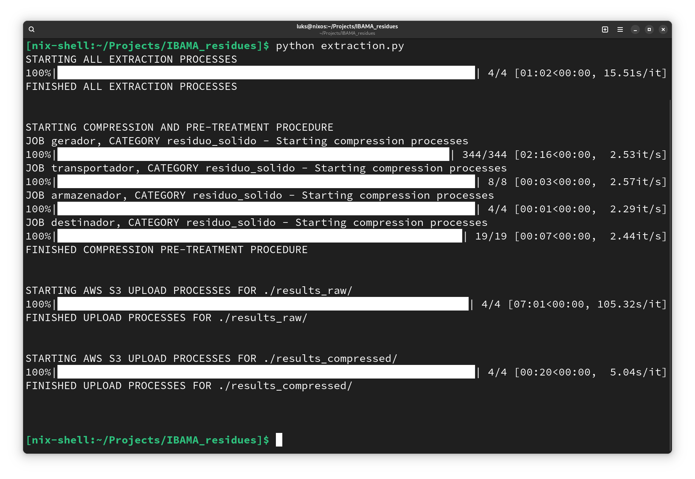
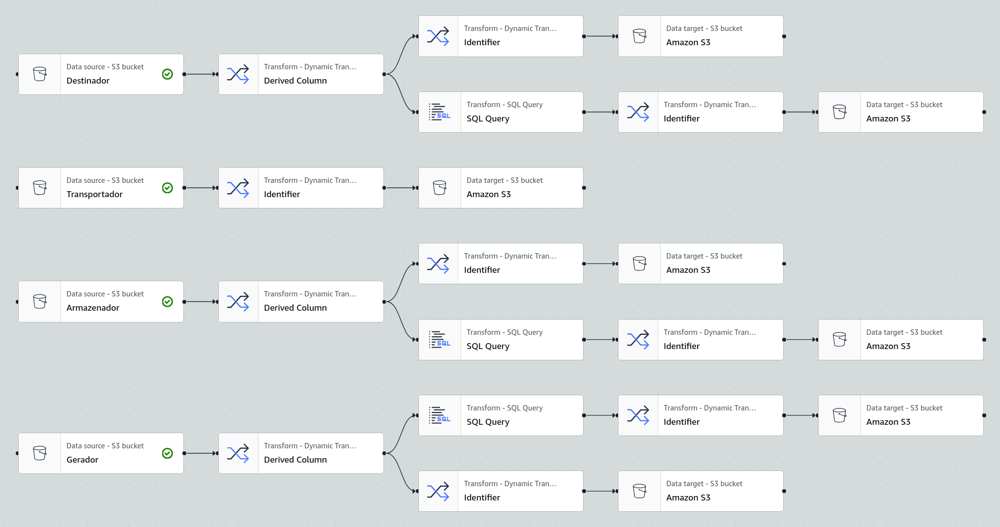
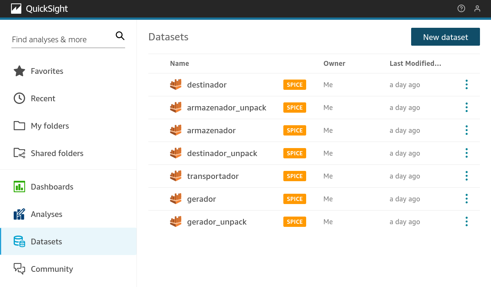

# IBAMA_residues

> [!NOTE]
> Repositório desttinado a apresentação de projeto pós graduação. Por esse motivo, versionado e documentado parcialmente me português.
> Repository solely destinated to present post-grad projects in Brazil, hence the documentation partially in portuguese.

## Motivação

No Brasil, resíduos são produzidos e grande quantidade pelas mais diversas atividades. Bilhões de litros de líquidos e trilhões de kilogramas de sólidos são gerados todos os anos, em grande parte perigosos e/ou danosos à saúde do homem, da fauna e da flora. O controle quantitativo de todo esse material existe e hoje é realizado pelo [IBAMA](https://www.gov.br/ibama/pt-br). Entretanto, a difusão dessa informação é ruim e de difícil acesso pelo cidadão médio. O presente projeto visa então prover esse acesso de maneira facilitada e clara, implementando diversas técnicas da engenharia de dados.

## Arquitetura

Aqui é utilizado o ambiente de nuvem [Amazon Web Services](https://aws.amazon.com/) (AWS), nele foi implementado um procedimento padrão de [*Extract Transform Load*](https://www.google.com/search?client=firefox-b-d&q=etl+wiki) (ETL) da seguinte maneira:

## Implementação

Abaixo são demonstrados alguns pontos principais da implementação:

### Extração (local, Lambda, E2C)

### Transformação (Glue, Spark):
- Tosdas as trasformações realidadas nos dasdos em interface AWS Glue se tutilizam de transformações SQL em ambiente ApacheSpark (pyspark).
- É feita análise textual quantitativa relacionando não só frequência  de ocorrêndcia de palavras, com também seu immpacto relativo nas emissões.

### Carregamento (Athena, Spice e QuickSight)

### Uso (QuickSight)

## Conclusão
O projeto demonstrou a implementção completa de uma pipeline de dados usando o ecossistema AWS, de maneira a dar publicidade a dados de interesse público. Assim se mostra como completa em seu estado inicial.

